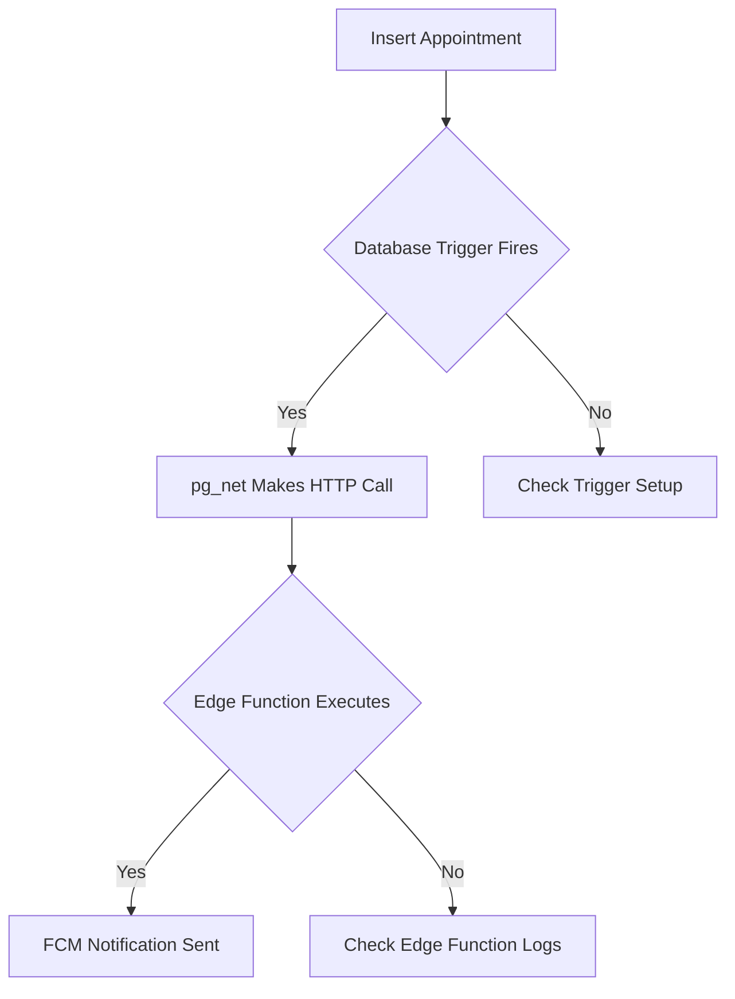

# Setting Up the Database Trigger for Appointment Notifications

This guide will help you set up the database trigger that automatically invokes the Edge Function whenever a new appointment is created.

## Step 1: Install the Trigger

1. Go to [Supabase SQL Editor](https://supabase.com/dashboard/project/szcvvdedhulcrgpanudt/sql)
2. Create a new query
3. Copy and paste the contents of `appointment_trigger.sql`
4. Click "Run" to execute the SQL script

This script will:
- Enable the `pg_net` extension (required for HTTP calls)
- Create a trigger function that calls your edge function
- Set up the trigger on the `appointments` table

## Step 2: Verify the Trigger Setup

After running the script, you should see a notice message:
```
Appointment notification trigger installed successfully
```

## Step 3: Test with a Sample Appointment

You have two options to test:

### Option A: Using the SQL Editor

1. Go to [Supabase SQL Editor](https://supabase.com/dashboard/project/szcvvdedhulcrgpanudt/sql) again
2. Create a new query
3. Copy and paste the contents of `test_appointment_trigger.sql`
4. Adjust fields if necessary to match your table structure
5. Click "Run" to execute the test

### Option B: Using Your Web App

Create a new appointment using your web application's normal flow.

## Step 4: Check Logs to Verify

1. Check Edge Function logs:
   - Go to [Edge Functions](https://supabase.com/dashboard/project/szcvvdedhulcrgpanudt/functions)
   - Click on `appointment-notifications`
   - Click "Logs" tab
   - Look for recent invocations and check if they were successful

2. Check Database logs:
   - Go to [Database Settings](https://supabase.com/dashboard/project/szcvvdedhulcrgpanudt/database/logs)
   - Look for messages like:
     ```
     Appointment trigger executing for appointment ID: ...
     Appointment notification sent for appointment ID: ...
     ```

## Common Issues and Fixes

### Trigger Not Firing

If the trigger doesn't seem to be firing:

1. Check if the `pg_net` extension is enabled:
   ```sql
   SELECT * FROM pg_extension WHERE extname = 'pg_net';
   ```
   If it returns no rows, the extension is not enabled. Contact Supabase support.

2. Verify the trigger exists:
   ```sql
   SELECT * FROM pg_trigger WHERE tgname = 'appointment_created_trigger';
   ```

3. Check for any errors in the database logs.

### Edge Function Not Executing

If the trigger fires but the edge function is not executing:

1. Check that the authorization token in the trigger is valid
2. Verify the edge function URL is correct
3. Try calling the edge function directly using the test script

## Debugging Your Trigger

If you need to see more details about what's happening:

```sql
-- Add this to your SQL Editor to check recent PostgreSQL logs
SELECT * FROM pg_logs 
WHERE log_time > NOW() - INTERVAL '1 hour'
AND message LIKE '%Appointment%'
ORDER BY log_time DESC
LIMIT 100;
```

## Flow Diagram

