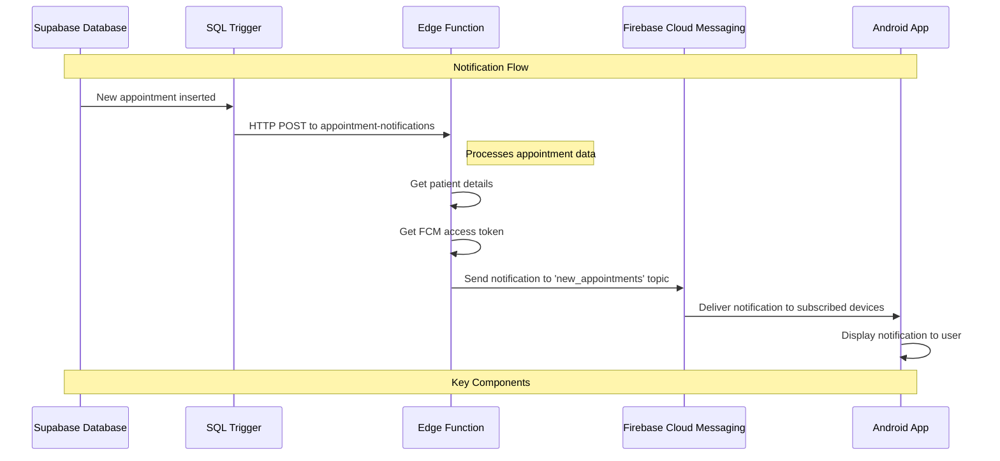
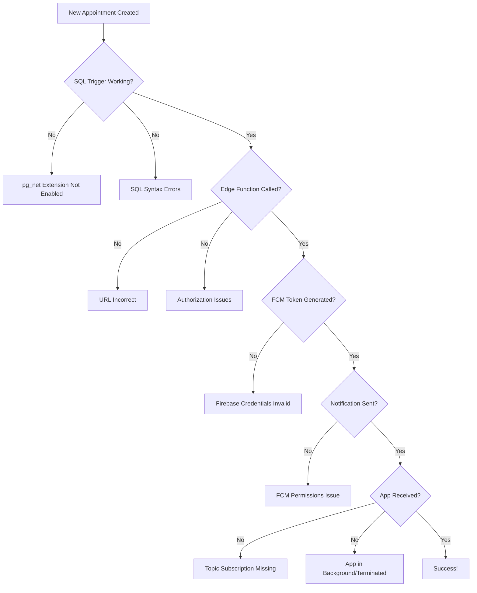

# Firebase Cloud Messaging Notification Flow

The following diagram illustrates the flow of notifications from your Supabase database to your Android app using Firebase Cloud Messaging.

## Detailed Process Explanation

1. **SQL Insert Trigger**: 
   - When a new appointment is inserted into the `appointments` table, a PostgreSQL trigger is activated
   - This trigger uses the `pg_net` extension to make an HTTP call to your Edge Function

2. **Edge Function Processing**:
   - Receives appointment data from the trigger
   - Fetches additional patient details from the database
   - Gets an access token for Firebase by signing a JWT
   - Creates and sends the notification payload to FCM

3. **Firebase Cloud Messaging**:
   - Receives the notification request with an authorization token
   - Delivers the notification to all devices subscribed to the 'new_appointments' topic

4. **Android Application**:
   - Subscribes to the 'new_appointments' topic on startup
   - Receives and processes the notification
   - Displays it to the user with the patient name and appointment time

## Common Failure Points

This visual representation should help you understand where potential issues might occur in the notification pipeline and how to address them. 