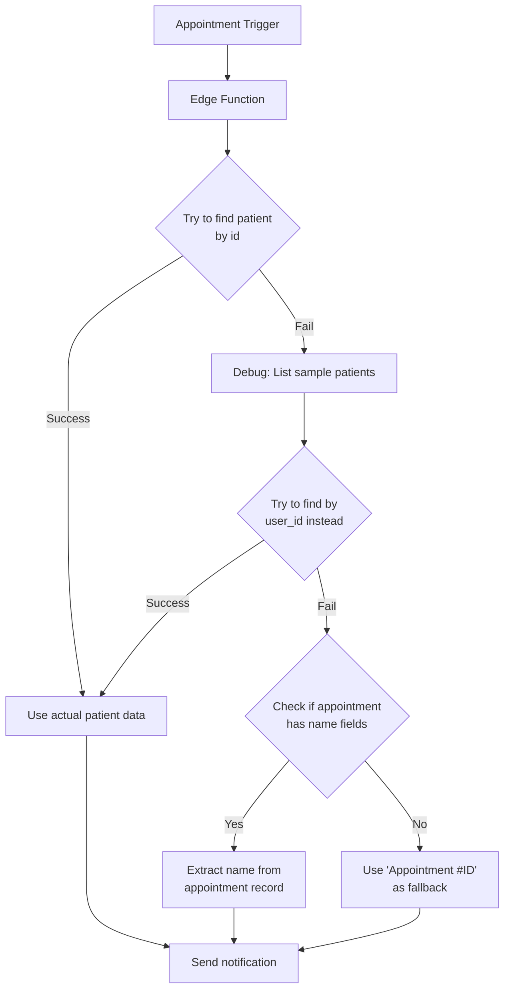

# Fixing the Patient Name in Notifications

We've addressed the issue where notifications showed "New appointment scheduled with Test Patient" instead of the actual patient name.

## The Problem

The edge function was falling back to using mock patient data (`Test Patient`) whenever it couldn't find the real patient data. This was happening because:

1. The `patient_id` in the appointment record may not match how it's stored in the `patients` table
2. The database query permissions might be restricting access to patient records
3. The patients table structure may be different than expected

## The Solution

We've implemented a more robust patient data lookup strategy that:

1. Tries multiple approaches to find the patient data
2. Provides better debugging information
3. Uses more meaningful fallback values when a patient can't be found

## Implementation Details

## Changes Made

1. **Enhanced Patient Lookup**:
   - First tries the standard method of looking up by `patient_id`
   - If that fails, it tries looking up by `user_id`
   - It logs sample patient IDs to help debug mismatches

2. **Improved Fallbacks**:
   - Checks if the appointment record itself contains name information
   - Uses smarter fallback text showing "Appointment #ID" rather than generic "Test Patient"
   - Provides more detailed logs to help troubleshoot future issues

3. **Better Error Handling**:
   - Added try/catch around the entire patient lookup process
   - Logs all errors and fallback strategies
   - Ensures notifications always go out even if patient lookup fails

## Deployment Instructions

1. Go to [Supabase Edge Functions](https://supabase.com/dashboard/project/szcvvdedhulcrgpanudt/functions)
2. Click on `appointment-notifications` function
3. Replace the entire code with the updated `edge-function-final.ts` content
4. Click "Deploy"

## Testing

After deployment, test it by:

1. Creating a new appointment through your web app
2. Check the Edge Function logs to see the patient lookup process
3. Verify that the notification shows the correct patient name

## Troubleshooting

If you're still seeing issues, check:

1. **Database Structure**:
   - Run `SELECT * FROM patients LIMIT 5` to see how patient data is structured
   - Check what field contains the ID referenced by appointments

2. **Examine Edge Function Logs**:
   - Look for the "Final patient data to use:" log message
   - Check if any errors are occurring during patient lookup

3. **Test Different Appointment Types**:
   - Try creating appointments with different patient types
   - Watch logs to see how the patient is being looked up 