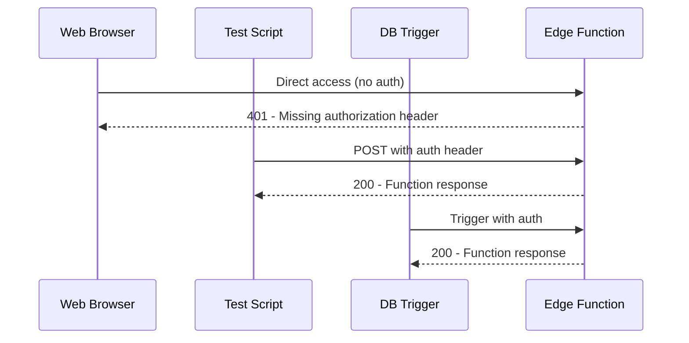

# Edge Function Update and Testing Guide

## Summary of Changes

We've modified the edge function to handle the case when a patient can't be found by creating a mock patient for testing purposes. This allows us to test the function even if the patient record doesn't exist in the database.

## Deployment Steps

### Option 1: Using Supabase Dashboard

1. Go to [Supabase Dashboard](https://supabase.com/dashboard/project/szcvvdedhulcrgpanudt/functions)
2. Click on "appointment-notifications" function
3. Click "Edit" and paste the updated TypeScript code from `supabase_functions_example/appointment-notifications.ts`
4. Click "Deploy" button

### Option 2: Using Supabase CLI

```bash
# Install Supabase CLI if not already installed
npm install -g supabase

# Login to Supabase
supabase login

# Deploy the function
supabase functions deploy appointment-notifications --project-ref szcvvdedhulcrgpanudt
```

## Testing the Function

After deployment, you can test the function using the Node.js script we created:

```bash
node test_edge_function.js
```

## Understanding the 401 Error

The 401 error `{"code":401,"message":"Missing authorization header"}` when accessing the function URL directly in your browser is normal and expected behavior. Edge functions require authentication by default.

Here's how different access methods work:



## Testing via SQL Trigger

To test the complete flow including the database trigger:

1. Go to the [Supabase SQL Editor](https://supabase.com/dashboard/project/szcvvdedhulcrgpanudt/sql)
2. Run this test SQL:

```sql
INSERT INTO appointments (patient_id, appointment_date, status) 
VALUES ('test-patient-id', NOW(), 'scheduled');
```

3. Check the [Edge Function logs](https://supabase.com/dashboard/project/szcvvdedhulcrgpanudt/functions/logs) to see if the function was triggered

## Debugging Guidelines

If issues persist:

1. Check the Edge Function logs in the Supabase Dashboard
2. Ensure the pg_net extension is enabled
3. Verify the SQL trigger is correctly configured
4. Test the FCM notification directly using the test_fcm_notification.js script
5. Make sure your Android app is properly subscribing to the "new_appointments" topic 